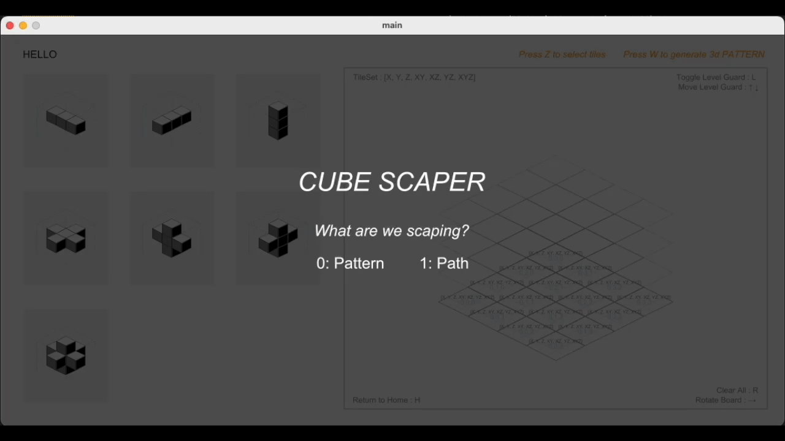
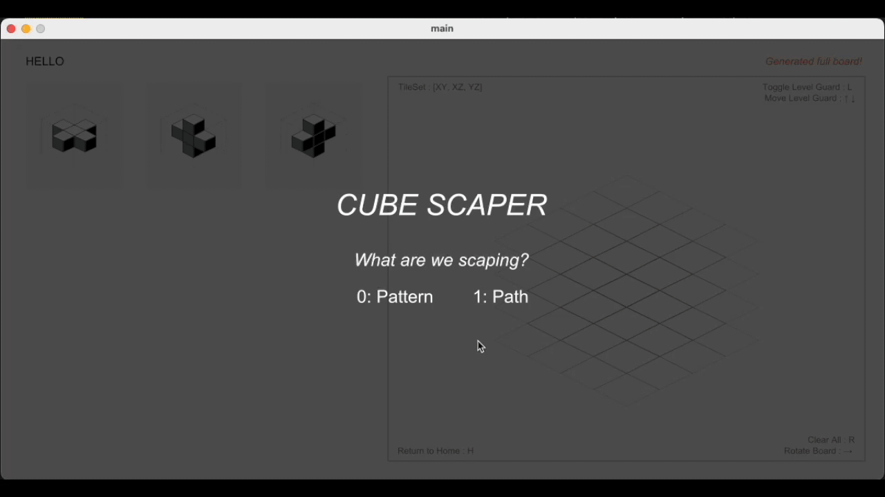

# Cube Scaper
<p align="center">

<p>

<p align="center">
<br>
<p>

**Cube Scaper** is a constraint-based world generation project where tiles can be placed in a 2.5D space according to the tile set’s connectivity rules. It uses cubical 2.5D isometric geometry and the **Wave Function Collapse (WFC)** algorithm (Gumin, 2016).


## To Run

```bash
python main.py
```

### Dependencies

- `numpy`
- `copy`
- `matplotlib`
- `random`
<!-- - `cmu_cs3_graphics` -->
<!-- - `settings` -->
<!-- - `isometric` -->
<!-- - `tile` -->
<!-- - `tileSetB` (default tile set) -->

## Repo Structure:

```
cube_scaper/
├── cmu_graphics/         # Contains the core graphics module developed by CMU
├── cmu_cs3_graphics/     # Provides a wrapper around the CMU graphics module for easier integration
├── isometric.py          # Contains functions for handling isometric geometry, crucial for rendering tiles
├── main.py               # The entry point for running the application
├── settings.py           # Defines configuration settings for the app
├── tile.py               # Implements the Tile class, representing individual tiles and their properties
└── tileSetB/             # A directory containing a predefined tile set used in the app
```


## Instructions

0. Select Mode with `0`: Pattern Mode, `1`: Path Mode

---

### Pattern Mode
1. Click on a tile to select and place it on the board:
   - **Green**: Valid location
   - **Red**: Invalid location
2. Observe reduced neighbors on the level guide.
3. Press `R` to clear the board.
4. Press `Z` to select a modified tile set.
5. Press `Z` again to finalize the tile set.
6. Press `W` to generate a pattern.
7. Press `→` to rotate the board and view from all sides.
8. Press `R` to clear the board and tile set.

---

### Path Mode
<!--  -->

1. Press `S` to set the **START** tile, then click to place it on the board.
2. Press `E` to set the **END** tile, then click to place it on the board.
3. Place other tiles on the board.
4. Press `P` to check if there is a valid path from **START** to **END**:
   - If a path exists, it will display in **red**.
5. Press `→` to rotate the board and view from all sides.
6. Press `R` to clear the board, including the **START** and **END** tiles.


### Summary of Keys
- `H`: Return to home
- `R`: Clear all
- `L`: Toggle level guide
- `↑ / ↓`: Control level guide
- `→`: Rotate board (use after generation)
- `Z`: Toggle select tile mode (Pattern Mode)
- `W`: Generate pattern (Pattern Mode)
- `S`: Set START tile (Path Mode)
- `E`: Set END tile (Path Mode)
- `P`: Generate Tile (Path Mode)
